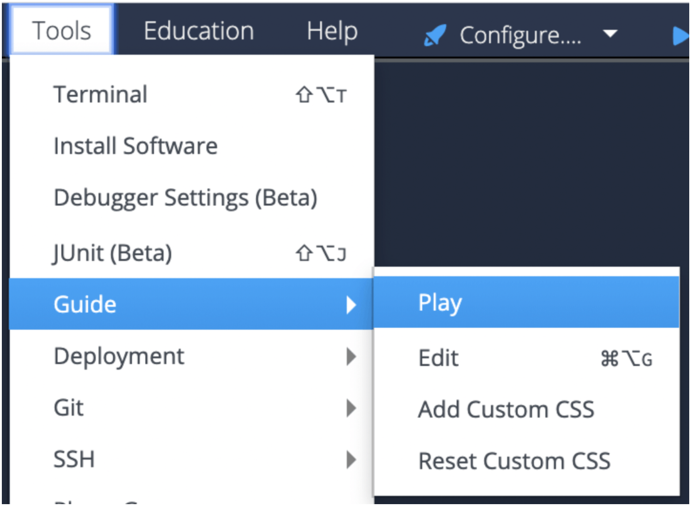

# Hello Processing/p5 in Codio

This project shows you a sample lesson page in Codio and then explains how it was built. 

Feel free to edit and try things out -- if you need a new copy of this project use one of the links below.

* For Codio.com users, go to this [starter pack](https://codio.com/home/starter-packs/1c0b30a8-1d8c-4882-836c-954942411d32)
* For Codio.co.uk users, go to this [starter pack](https://codio.co.uk/home/starter-packs/1c0b30a8-1d8c-4882-836c-954942411d32)

## Start the Guide to see the project
To start the Guides Editor, go to the tool bar at the top and select **Tools > Guide > Play.**

